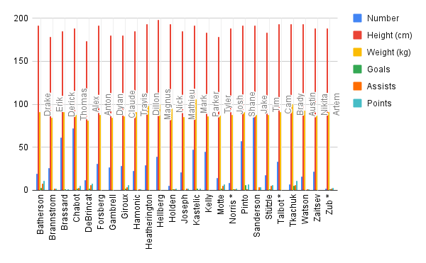

**2025-11-6 **<br>
**MPAD 2003 Data Storytelling**<br>
**Tyler Jardine, **<br>
**Presented to Jean-Sébastien Marier**<br>

# Exploratory Data Analysis (EDA) & Pitch

## 1. Introduction

For our project, we looked at the [City of Ottawa’s 2021 Long Form Census – Ward Data.](https://www.arcgis.com/sharing/rest/content/items/59b3ea74ecea4a8a9d7fb797190bbdb8/data) This dataset was originally collected by Statistics Canada and was published under Ottawa’s open data portal. Our idea was to go in and compare the different education levels between the wards to see if there was anything interesting. We broke down the data into just 3 separate columns: Wards, Population of the Ward, and population of the ward who has acquired any form of post-secondary education, whether that's a certificate or a master's degree. The following sections contain our process: getting the data, cleaning the data by removing unwanted or incorrect info, preforming an explortatory data analysis, preforming a VIMO analysis, and finally picking out a potential story.

## 2. Getting Data

##
We imported the data from the City of Ottawa data set about the 2021 Long Form Census Ward Data set. The file is an Excell csv. We cleaned the data sets and removed about 2000 rows. We left the wards column, and we kept the following  rows: total population, and the total number of all post-secondary certificates, in each ward. The link to the excell sheet is 2021_Long_Form_Census_-_Ward_Data.csv.xlsx

The screenshot is attached. There are 24 collumns and 3 rows. The data looks clean, and using the charts, we can see a rough version of statistics and visual patterns. The sample size is huge, which is very helpful for us to see any clear correlations or unusual discoveries. We are dealing with population, and post secondary certificates. We want to see if there are some wards that have a significantly lower certificate percentage than other wards. Does it really matter what ward you live in if you want to receive a post secondary certificate? 
# 2021 Long-Form Census – Ward Data

You can download the spreadsheet here:  
[Download the spreadsheet](./2021_Long_Form_Census_-_Ward_Data.csv.xlsx)


*Figure 1: The Refined Data.*


**Here are examples of functions and lines of code put in grey boxes:**

1. If you name a function, put it between "angled" quotation marks like this: `IMPORTHTML`.
1. If you want to include the entire line of code, do the same thing, albeit with your entire code: `=IMPORTHTML("https://en.wikipedia.org/wiki/China"; "table", 5)`.
1. Alternatively, you can put your code in an independent box using the template below:

``` r
=IMPORTHTML("https://en.wikipedia.org/wiki/China"; "table", 5)
```
This also shows how to create an ordered list. Simply put `1.` before each item.

## 3. Understanding Data

### 3.1. VIMO Analysis

Use three hashtag symbols (`###`) to create a level 3 heading like this one. Please follow this template when it comes to level 1 and level 2 headings. However, you can use level 3 headings as you see fit.

Insert text here.

Support your claims by citing relevant sources. Please follow [APA guidelines for in-text citations](https://apastyle.apa.org/style-grammar-guidelines/citations).

**For example:**

 (2021) City of Ottawa.

### 3.2. Cleaning Data

We deleted a lot of rows that were irrelevant of our findings.  There were 2000 rows of different topics, so we did not need to do any splitting, or excel shortcuts.  We used open refine to fix the zeros and headings.  Here is an image of what the original data sheet looked like.


*Figure 2: Unrefined Original Data.*

### 3.3. Exploratory Data Analysis (EDA)

Insert text here.

**This section should include a screen capture of your pivot table, like so:**

<br>
*Figure 2: This pivot table shows...*

<br>
*Figure 2: This is the Carleton University logo...*

**This section should also include a screen capture of your exploratory chart, like so:**

<br>
*Figure 3: This exploratory chart shows...*

## 4. Potential Story

Our group wants to look into whether the area someone lives in within Ottawa has any connection to their chances of earning a post-secondary certificate. The dataset we’re using includes the total population and the total number of post-secondary certificates in each ward. When we first looked at the numbers, we noticed that some wards have a much higher rate of post-secondary education than others. That got us wondering, does your ward actually influence your level of education?
To dig deeper into this, we’ll need to look at more than just the numbers. We plan to explore things like average household income, access to transit, and how close each ward is to schools or universities. Visual charts and ward maps will also help show these differences clearly.
We could interview City of Ottawa officials, school board members, and post-secondary outreach staff to get their views on why some areas seem to do better. Talking to students and residents from different wards could also give us a better idea of what factors play a 

## 5. Conclusion

While working on this project, we learned a lot about how data can show real patterns in a city. Our main goal was to find out if where someone lives in Ottawa affects their chances of earning a post-secondary certificate. We spent time cleaning the dataset and choosing the most useful information to focus on.
The hardest part was organizing the data and making sure everything was accurate after we deleted unnecessary rows. It was also a bit tricky to understand what some of the columns meant at first. The most rewarding part was seeing the results clearly through charts and graphs. It helped us see which wards stood out the most.
We did notice some gaps in our knowledge, like how other factors such as income or transportation could change the results. If we could do this again, we’d look at more variables to get a better picture of education across Ottawa.

## 6. References

Include a list of your references here. Please follow [APA guidelines for references](https://apastyle.apa.org/style-grammar-guidelines/references). Hanging paragraphs aren't required though.

**Here's an example:**

Bounegru, L., & Gray, J. (Eds.). (2021). *The Data Journalism Handbook 2: Towards A Critical Data Practice*. Amsterdam University Press. [https://ocul-crl.primo.exlibrisgroup.com/permalink/01OCUL_CRL/hgdufh/alma991022890087305153](https://ocul-crl.primo.exlibrisgroup.com/permalink/01OCUL_CRL/hgdufh/alma991022890087305153)
