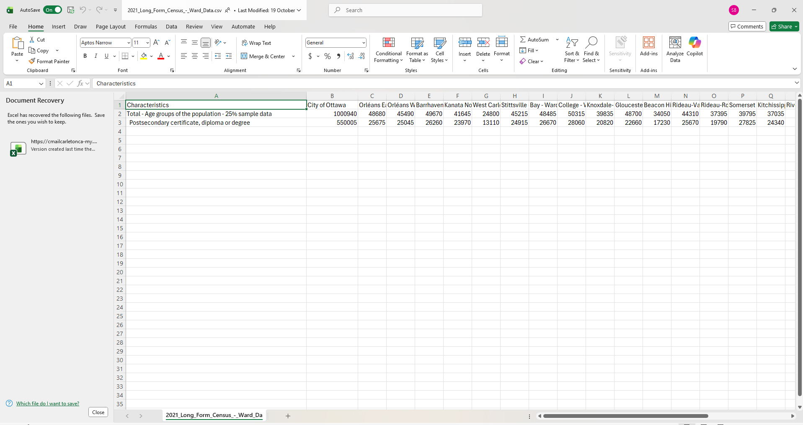
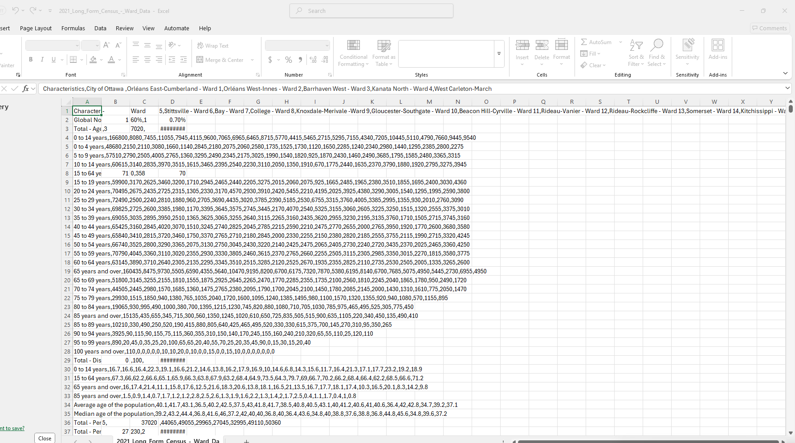

**Date**<br>
**Course Code & Course Name**<br>
**Student's First Name & Last Name**<br>
**Presented to Jean-Sébastien Marier**<br>

# Exploratory Data Analysis (EDA) & Pitch

Use one hashtag symbol (`#`) to create a level 1 heading like this one.

## Foreword

For this assignment, you must extract data from a dataset provided by the instructor. You must then clean and analyze the data, create exploratory charts/visualizations, and find a potential story idea. Your assignment must clearly detail your process. You are expected to write about 1500-2000 words, and to include several screen captures showing the different steps you went through. Your assignment must be written with the Markdown format and submitted on GitHub Classroom.

I have been assigning different versions of this project to my digital journalism and data storytelling students for a few years now. Its structure was inspired by the main sections/chapters of [*The Data Journalism Handbook*](https://datajournalism.com/read/handbook/one/). This version was further inspired by the [Key Capabilities in Data Science](https://extendedlearning.ubc.ca/programs/key-capabilities-data-science) program offered by the University of British Columbia (UBC).

**Here are some useful resources for this assignment:**

* [GitHub's *Basic writing and formatting syntax* page](https://docs.github.com/en/get-started/writing-on-github/getting-started-with-writing-and-formatting-on-github/basic-writing-and-formatting-syntax)
* [The template repository for this assignment in case you delete something by mistake](https://github.com/jsmarier/jou4100_jou4500_mpad2003_project2_template)

Did you notice how to create a hyperlink? In Markdown, we put the clickable text between square brackets and the actual URL between parentheses.

And to create an unordered list, we simply put a star (`*`) before each item.

## 1. Introduction

Insert text here.

## 2. Getting Data

##
We imported the data from the City of Ottawa data set about the 2021 Long Form Census Ward Data set. The file is an Excell csv. We cleaned the data sets and removed about 2000 rows. We left the wards column, and we kept the following  rows: total population, and the total number of all post-secondary certificates, in each ward. The link to the excell sheet is 2021_Long_Form_Census_-_Ward_Data.csv.xlsx

The screenshot is attached. There are 24 collumns and 3 rows. The data looks clean, and using the charts, we can see a rough version of statistics and visual patterns. The sample size is huge, which is very helpful for us to see any clear correlations or unusual discoveries. We are dealing with population, and post secondary certificates. We want to see if there are some wards that have a significantly lower certificate percentage than other wards. Does it really matter what ward you live in if you want to receive a post secondary certificate? 
# 2021 Long-Form Census – Ward Data

You can download the spreadsheet here:  
[Download the spreadsheet](./2021_Long_Form_Census_-_Ward_Data.csv.xlsx)




*Figure 1: The Refined Data.*


**Here are examples of functions and lines of code put in grey boxes:**

1. If you name a function, put it between "angled" quotation marks like this: `IMPORTHTML`.
1. If you want to include the entire line of code, do the same thing, albeit with your entire code: `=IMPORTHTML("https://en.wikipedia.org/wiki/China"; "table", 5)`.
1. Alternatively, you can put your code in an independent box using the template below:

``` r
=IMPORTHTML("https://en.wikipedia.org/wiki/China"; "table", 5)
```
This also shows how to create an ordered list. Simply put `1.` before each item.

## 3. Understanding Data

### 3.1. VIMO Analysis

Use three hashtag symbols (`###`) to create a level 3 heading like this one. Please follow this template when it comes to level 1 and level 2 headings. However, you can use level 3 headings as you see fit.

Insert text here.

Support your claims by citing relevant sources. Please follow [APA guidelines for in-text citations](https://apastyle.apa.org/style-grammar-guidelines/citations).

**For example:**

 (2021) City of Ottawa.

### 3.2. Cleaning Data

We deleted a lot of rows that were irrelevant of our findings.  There were 2000 rows of different topics, so we did not need to do any splitting, or excel shortcuts.  We used open refine to fix the zeros and headings.  Here is an image of what the original data sheet looked like.


*Figure 2: Unrefined Original Data.*

### 3.3. Exploratory Data Analysis (EDA)

I selected Total population and Postsecondary certificate/diploma/degree counts since they respond to two fundamental questions about an educational EDA which are 
What is the number of individuals with postsecondary education at each ward?

What does that compare to the number of percent of the ward population who are credentialed?

Comparing the total counts and percentages enables our group to identify the wards that are large numbers of population with low measure of postsecondary students possible  and wards with small populations with high percentages of postsecondary students.

City Totals Population = 1,000,940; Postsecondary = 550,005 - Citywide rate 54.95%.

Share (percentage) in highest postsecondary:

Somerset (Ward 14): 69.92% - most significantly high persentage.

Other wards with high rates: Capital (Ward 17) 66.22%, Kitchissippi (Ward 15) 65.72%.

Lowest postsecondary share:

Gloucester- Southgate (Ward 10): 46.53% - lowest rate in the dataset.

Highest total number of postsecondary 
College (Ward 8): 28,060, Kanata South (Ward 23): 27,190, Barrhaven East (Ward 24): 26,615, Bay (Ward 7): 26,670 are the wards that have the largest number of credentialed residents which reflects on their larger population.

Biggest ward populations: Barrhaven East and College are of the biggest ones.


.png)
.png)
.png)

This comparison is made on the total population and number of residents with postsecondary certificates, diplomas or degrees of Ottawa 24 wards. The selection of these variables was based on the desire to study the level of educational attainment by the number of people and determine any spatial or demographic trends in the city.

Approximately 54.95% of all residents in the city have postsecondary credentials, although there is a high degree of difference in the rates across wards. Somerset (69.9), Capital (66.2), and Kitchissippi (65.7) have the highest percentage, and the lowest percentage in Gloucester-Southgate (46.5). College, Barrhaven East, and Kanata South have also the highest number of credentialed residents according to population size. Such a difference suggests that city means conceal local differences of significance.

The trend indicates that the inner-city wards are more likely to have high education levels, which may be related to their location near universities, professional job, or social economics, whereas some urban and rural wards have low rates. These data provoke also additional questions concerning the connection between education level and income, occupation, and access to postsecondary institutions.

The next steps to be taken are to analyze the data on age distribution, income, and occupation by ward to get a better idea of social and geographic determinants of education levels in Ottawa.

## 4. Potential Story

Our group wants to look into whether the area someone lives in within Ottawa has any connection to their chances of earning a post-secondary certificate. The dataset we’re using includes the total population and the total number of post-secondary certificates in each ward. When we first looked at the numbers, we noticed that some wards have a much higher rate of post-secondary education than others. That got us wondering, does your ward actually influence your level of education?
To dig deeper into this, we’ll need to look at more than just the numbers. We plan to explore things like average household income, access to transit, and how close each ward is to schools or universities. Visual charts and ward maps will also help show these differences clearly.
We could interview City of Ottawa officials, school board members, and post-secondary outreach staff to get their views on why some areas seem to do better. Talking to students and residents from different wards could also give us a better idea of what factors play a 

## 5. Conclusion

While working on this project, we learned a lot about how data can show real patterns in a city. Our main goal was to find out if where someone lives in Ottawa affects their chances of earning a post-secondary certificate. We spent time cleaning the dataset and choosing the most useful information to focus on.
The hardest part was organizing the data and making sure everything was accurate after we deleted unnecessary rows. It was also a bit tricky to understand what some of the columns meant at first. The most rewarding part was seeing the results clearly through charts and graphs. It helped us see which wards stood out the most.
We did notice some gaps in our knowledge, like how other factors such as income or transportation could change the results. If we could do this again, we’d look at more variables to get a better picture of education across Ottawa.

## 6. References

Include a list of your references here. Please follow [APA guidelines for references](https://apastyle.apa.org/style-grammar-guidelines/references). Hanging paragraphs aren't required though.

**Here's an example:**

Bounegru, L., & Gray, J. (Eds.). (2021). *The Data Journalism Handbook 2: Towards A Critical Data Practice*. Amsterdam University Press. [https://ocul-crl.primo.exlibrisgroup.com/permalink/01OCUL_CRL/hgdufh/alma991022890087305153](https://ocul-crl.primo.exlibrisgroup.com/permalink/01OCUL_CRL/hgdufh/alma991022890087305153)
